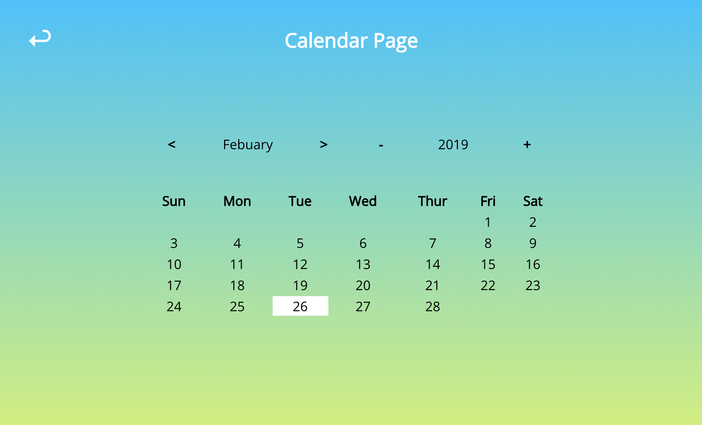

# React Calendar App
Practice ES7 & React v16+ by implementing a calendar component library with custom made react-redux and react-router.

http://react-calendar-and-reactreduxconnect-reactrouter-from-scratch.s3-website-us-east-1.amazonaws.com/

## Core Objective
Create a web app with a calendar that:
- Displays any month of any year with the right start Day 1 (eg. Feb 1st 2019 starts on a Friday)
- Shows the day of the week properly
- Unit tests for date calculation functions

## Additional Objectives
- Can add/remove events to the calendar
- Events have a title, description, date, start datetime and end datetime
- Calendar can display multiple events in a day
- Calendar can display multi-day events

## Constraints
You cannot use any of the following libraries. You must re-implement them from scratch.
- `react-router`
- `react-redux`

## Results

